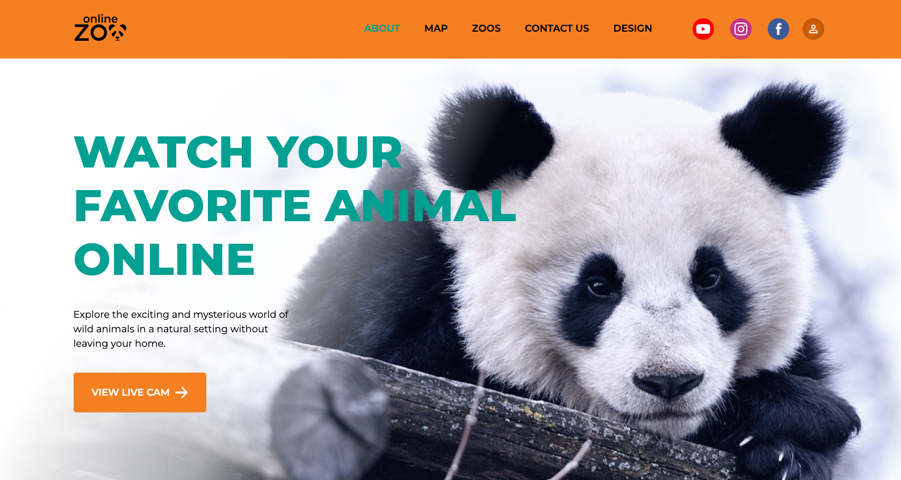
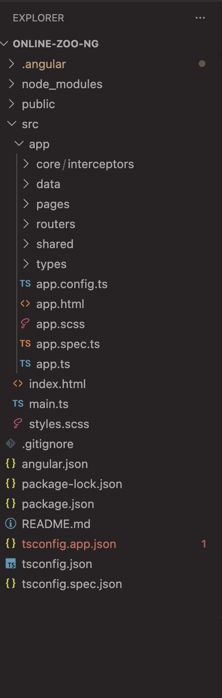
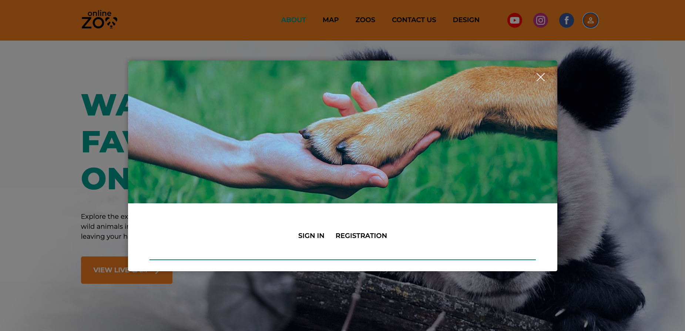

1. Task: [Online ZOO](https://github.com/rolling-scopes-school/qualifying-stage/blob/main/tasks/creative-extension/online-zoo.md)
2. Deploy: [Online ZOO](https://online-zoo-ng.netlify.app/)

---

marp: true
theme: gaia
paginate: true

---

# 🐾 Online Zoo  

### Migration from Vanilla TypeScript to Angular  

Frontend Developer Project  

---

## Key Focus

- Architecture  

- Performance optimization  

- Custom UI logic  

---

# 🧩 What is this project?



- Interactive zoo website  

- Multiple sections and pages  

- Focus on user experience  

👉 Migrated from static project to Angular  

---

# 🚀 Initial Version


## Vanilla TypeScript

- HTML / CSS / TypeScript  

- No frameworks  

- Manual DOM manipulation  

- Event handling  

💡 Learned how JavaScript works under the hood  

---

# 🔄 Migration to Angular



## Why Angular?

- Better architecture  

- Reusability  

- Maintainability  

👉 Refactored entire project  

---

# 🏗 Architecture


- Components → UI  

- Services → logic  

- ApiService → data layer  

👉 Clear separation of concerns  

---

# 🗂 Project Structure


- pages → feature modules  

- shared → reusable components  

- services → business logic  

👉 Scalable and maintainable structure  

---

# 📦 Data Handling

Example state structure:


```ts

interface ResponseState<T> {
  data: T | null;
  error: string | null;
  loading?: boolean;
  image?: string;
}

```

- Simulates API behavior  
- Handles loading and errors  

---

# 🔌 API Layer

## Universal GET Request
```ts
getAll<T>(path: string): Observable<ResponseState<T>> {
  return this.http.get<T>(path).pipe(
    map((res) => ({
      data: res,
      error: null,
      loading: false,
    })),
    startWith({
      data: null,
      error: null,
      loading: true,
    }),
  catchError((err) =>
      of({
        data: null,
        error: err.message,
        loading: false,
      })
    )
  );
}
```

- Generic typing  
- Centralized data handling  
- Reusable across the app  

---

# 🎞 Custom Slider


- Built from scratch  
- No external libraries  

👉 Logic:

[A, B, C] → [B, C, A]

👉 Added smooth animation  

---

# ⚡ Performance Optimization

## Angular @defer

@defer (on viewport)

- Lazy loading sections  
- Faster initial load  

---

# 🎨 UI / UX



- Popups (auth, map, donate)  
- Navigation between animals  
- Responsive layout  

👉 Clean user experience  

---

# 🧠 Challenges

- Migration from DOM to Angular  
- State management without backend  
- Custom slider implementation  
- Animations without libraries  

---

# 📈 Results

- Improved performance  
- Better architecture  
- Reusable logic  

👉 Production-ready structure  

---

# 💡 What I improved

- Scalable architecture  
- Clean code structure  
- Optimized loading  
- Better UX  

---

# 🎯 Conclusion

👉 This project demonstrates:

- Strong JavaScript fundamentals  
- Angular architecture skills  
- Ability to refactor real applications  

---

# 🎤 Thank you! 😊
